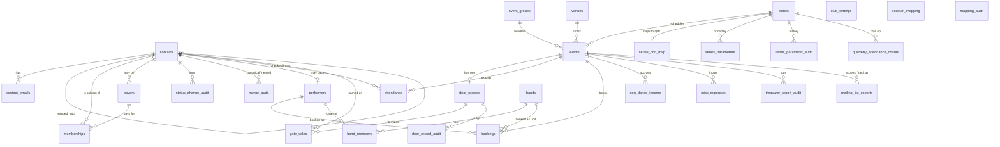

# zak1 — Data Model

_Point-in-time snapshot of the complete database schema, derived from the Drizzle schema
(`src/server/db/schema/`) and the hand-authored SQL migrations (`src/server/db/migrations/0001`–`0014`).
Current as of migration `0014_venues.sql`._

This is the single source-of-truth catalog for the CDR (Country Dancers of Rochester) platform's
Postgres schema across all implemented features (001–009).

## Conventions (apply everywhere unless noted)

- **PostgreSQL 16**, accessed via Drizzle ORM. Migrations are hand-authored SQL, each in its own
  transaction.
- **Primary keys** are `uuid` with `DEFAULT gen_random_uuid()`, except: `account_mapping` (text
  `line_key`), `series_qbo_map` (`series_id` is both PK and FK), `club_settings` (`smallint id`
  pinned to `1`).
- **Money is stored as integer cents everywhere** (columns named `*_cents`). Never floats.
- **Timestamps** are `timestamptz`; `created_at`/`updated_at` default to `now()`. Calendar dates
  (event date, membership expiry, parameter effective date) are `date`, handled as `YYYY-MM-DD`.
- **Extensions** (enabled in `0001`): `pg_trgm` (fuzzy contact-name search) and `citext`
  (case-insensitive email).
- **Audit tables** are append-only. There is also a lightweight structured-log audit (pino) that is
  not a table.
- The internal `_migrations` bookkeeping table is omitted here.

## Entity-Relationship Diagram

_(`club_settings`, `account_mapping`, and `mapping_audit` are standalone — no foreign keys.)_

## Enums

| Enum | Values | Used by |
|---|---|---|
| `email_purpose` | personal, booking, public_profile, other | `contact_emails.purposes[]` |
| `email_status` | active, transition, inactive | `contact_emails.status` |
| `membership_status` | current, lapsed, long_lapsed, never | `contacts.membership_status`, `status_change_audit` |
| `volunteer_role` | door_attendant, administrator | `contacts.volunteer_roles[]` |
| `email_consent_topic` | contra, english, openband, special_events, jane_austen_ball, contact_tracing, do_not_contact | `contact_emails.consent_topics[]` |
| `gate_category` | admission, merchandise, donation, future_event, membership, gift_card, misc_sales | `gate_sales.category` |
| `payment_method` | cash, card | `gate_sales.payment_method` |
| `event_group_kind` | double_dance, weekend, jane_austen_ball, other | `event_groups.kind` |
| `performer_type` | caller, lead_musician, musician, open_band_musician, sound_tech, instructor | `bookings.performer_type` |
| `parameter_category` | rate, expense | `series_parameters.category` |
| `parameter_kind` | caller, sound_tech, musician, rent, ongoing | `series_parameters.kind` |
| `mailing_list_id` | contra, english, openband, specialevents, janeaustenball, performer, member, contact_tracing | `mailing_list_exports.list_id` |

---

## 1. Contacts & Membership (feature 001)

### `contacts`
The person directory — the hub most other data links to.

| Column | Type | Notes |
|---|---|---|
| id | uuid PK | |
| display_name | text NOT NULL | CHECK non-empty |
| name_normalized | text NOT NULL | lowercased/collapsed; trigram-indexed for fuzzy search |
| membership_status | membership_status NOT NULL default `never` | materialized; recomputed on membership change + nightly |
| list_member | boolean NOT NULL default false | `status != never` — drives the member mailing list |
| status_recomputed_at | timestamptz NULL | |
| is_volunteer | boolean NOT NULL default false | |
| volunteer_roles | volunteer_role[] NOT NULL default `{}` | CHECK: roles allowed only if `is_volunteer` |
| merged_into_id | uuid NULL → contacts(id) | self-FK; non-null means this row was merged away |
| needs_review | boolean NOT NULL default false | door-created / no-contact-info contacts flagged for admin |
| source | text NULL | e.g. `door`, `performer` |
| phone | text NULL | optional (feature: contact may give phone instead of email) |
| created_at, updated_at | timestamptz | |

- **Indexes**: `contacts_name_trgm` (GIN trigram on `name_normalized`); partial `contacts_active` on `id WHERE merged_into_id IS NULL`.
- **Domain rules**: `membership_status`/`list_member` are **materialized** (recomputed by the membership service + nightly job), not derived on read. Dedup **merges are soft** — the merged row stays with `merged_into_id` set; active queries filter `merged_into_id IS NULL`.

### `contact_emails`
Multiple emails per contact, each with its own purposes/consent.

| Column | Type | Notes |
|---|---|---|
| id | uuid PK | |
| contact_id | uuid NOT NULL → contacts(id) ON DELETE CASCADE | |
| email | citext NOT NULL | case-insensitive |
| purposes | email_purpose[] NOT NULL default `{personal}` | CHECK ≥1; GIN-indexed |
| consent_topics | email_consent_topic[] NOT NULL default `{contact_tracing}` | CHECK ≥1; GIN-indexed |
| status | email_status NOT NULL default `active` | |
| is_login | boolean NOT NULL default false | login allowed only on volunteer contacts (service rule) |
| provider_set_date, provider_last_open, provider_last_click | timestamptz NULL | read-only provider telemetry (iContact) |
| created_at, updated_at | timestamptz | |

- **Unique**: partial unique on `lower(trim(email)) WHERE status IN ('active','transition')` — an email can't be active on two contacts at once.
- **Domain rules**: `contact_tracing` is the **default** consent topic on a new email. `do_not_contact` is exclusive — the service collapses `consent_topics` to exactly `{do_not_contact}` when set, so a DNC email can never match a content topic (this is what makes mailing-list exclusion "free").

### `payers`
Who paid for a membership (may differ from the member; may be an unlinked ad-hoc name).

| Column | Type | Notes |
|---|---|---|
| id | uuid PK | |
| contact_id | uuid NULL → contacts(id) ON DELETE SET NULL | optional linkage |
| name | text NOT NULL | CHECK non-empty |
| created_at | timestamptz | |

### `memberships`
One row per membership term; the contact's status is derived from the greatest expiry.

| Column | Type | Notes |
|---|---|---|
| id | uuid PK | |
| contact_id | uuid NOT NULL → contacts(id) ON DELETE CASCADE | |
| payer_id | uuid NOT NULL → payers(id) | |
| expiry_date | date NOT NULL | |
| created_at | timestamptz | |

- **Indexes**: `(contact_id)`, `(contact_id, expiry_date DESC)`.
- **Domain rule**: membership status is classified from `max(expiry_date)` vs. `club_settings.long_lapse_cycles` × cycle → current / lapsed / long_lapsed / never.

### `club_settings`
Singleton config row.

| Column | Type | Notes |
|---|---|---|
| id | smallint PK default 1 | CHECK `id = 1` (singleton) |
| long_lapse_cycles | integer NOT NULL default 3 | cycles before `long_lapsed` |
| cycle_definition | text NOT NULL default `1 year` | parsed as an interval |
| created_at, updated_at | timestamptz | |

### `status_change_audit`
Append-only log of membership-status transitions.

| Column | Type | Notes |
|---|---|---|
| id | uuid PK | |
| contact_id | uuid NOT NULL → contacts(id) ON DELETE CASCADE | |
| from_status | membership_status NULL | |
| to_status | membership_status NOT NULL | |
| reason | text NOT NULL | e.g. `membership_change`, `daily_job` |
| actor | text NULL | |
| created_at | timestamptz | |

### `merge_audit`
Append-only record of contact dedup merges.

| Column | Type | Notes |
|---|---|---|
| id | uuid PK | |
| canonical_id | uuid NOT NULL → contacts(id) | surviving contact |
| merged_id | uuid NOT NULL → contacts(id) | merged-away contact |
| actor | text NOT NULL | |
| relinked_counts | jsonb NOT NULL default `{}` | how many rows of each type were re-pointed |
| created_at | timestamptz | |

---

## 2. Series, Event Groups, Venues & Events (features 002, 007)

### `series`
A standing dance series (config; seeded).

| Column | Type | Notes |
|---|---|---|
| id | uuid PK | |
| key | text NOT NULL UNIQUE | e.g. `tnc`, `ecd`, `community_dance`, `general` |
| name | text NOT NULL | |
| has_sound_tech | boolean NOT NULL default true | false for Community Dance (blocks Sound Tech bookings) |
| created_at | timestamptz | |

- **Domain rule**: a `general` series exists for joint/cross-series events (added in feature 009); there is **no fallback** between series for rates/expenses.

### `event_groups`
Bundles related events (Double Dance, weekend festival, Jane Austen Ball).

| Column | Type | Notes |
|---|---|---|
| id | uuid PK | |
| name | text NOT NULL | |
| kind | event_group_kind NOT NULL | |
| created_at | timestamptz | |

### `venues` (feature 007)
Structured location for the public site's map.

| Column | Type | Notes |
|---|---|---|
| id | uuid PK | |
| name | text NOT NULL | |
| address | text NOT NULL | |
| latitude, longitude | double precision NULL | preferred over address for the map when present |
| created_at, updated_at | timestamptz | |

### `events`
A single scheduled dance.

| Column | Type | Notes |
|---|---|---|
| id | uuid PK | |
| series_id | uuid NOT NULL → series(id) | |
| group_id | uuid NULL → event_groups(id) | |
| venue_id | uuid NULL → venues(id) ON DELETE SET NULL | optional (feature 007) |
| event_date | date NOT NULL | |
| charges_admission | boolean NOT NULL default true | false for free events (e.g. Fringe) |
| attendance_count | integer NOT NULL default 0 | **persisted counter**, incremented per check-in |
| created_at | timestamptz | |

- **Indexes**: `(series_id, event_date)`, `(group_id)`.
- **Domain rule**: `attendance_count` is a durable counter that **survives the 90-day attendance purge** — it's the source for "paying dancers" in the organizer report after identifiable rows are gone.

---

## 3. Door, Gate & Attendance (feature 002)

### `door_records`
One per event; the money-capture header. **Exactly one per event** (unique `event_id`).

| Column | Type | Notes |
|---|---|---|
| id | uuid PK | |
| event_id | uuid NOT NULL UNIQUE → events(id) ON DELETE CASCADE | one-to-one |
| pos_transaction_count | integer NOT NULL default 0 | card ("PC") transaction count |
| pc_gross_cents | integer NOT NULL default 0 | card gross |
| pos_fee_cents | integer NOT NULL default 0 | card fee (hidden in UI; feeds Dance Net misc) |
| gross_cash_cents | integer NOT NULL default 0 | |
| seed_float_cents | integer NOT NULL default 1500 | starting till |
| cash_paid_out_cents | integer NOT NULL default 0 | |
| cash_paid_out_reason | text NULL | CHECK: required when `cash_paid_out_cents > 0` |
| deposit_cents | integer NOT NULL default 0 | |
| gift_card_redemption_count | integer NOT NULL default 0 | |
| created_at, updated_at | timestamptz | |

- **Domain rules**: **admission is DERIVED, never stored** — `admissionCash = grossCash − seedFloat − Σ(non-admission cash)`, `admissionCard = cardGross − Σ(non-admission card)`. **Deposit = gross cash − seed float − cash paid out.** "Card" is the canonical term (not POS/PC).

### `gate_sales`
Line items under a door record, per category × payment method.

| Column | Type | Notes |
|---|---|---|
| id | uuid PK | |
| door_record_id | uuid NOT NULL → door_records(id) ON DELETE CASCADE | |
| category | gate_category NOT NULL | everything except `admission` is "Non-Dance Income" |
| payment_method | payment_method NOT NULL | cash / card |
| amount_cents | integer NOT NULL default 0 | |
| contact_id | uuid NULL → contacts(id) ON DELETE SET NULL | required for named categories; null = anonymous |

- **Indexes**: `(contact_id)`.
- **Domain rule**: donation / future_event / membership are **named-customer receipts** (per-contact); other categories are anonymous.

### `door_record_audit`
Append-only log of door-record edits.

| Column | Type | Notes |
|---|---|---|
| id | uuid PK | |
| door_record_id | uuid NOT NULL → door_records(id) ON DELETE CASCADE | |
| action | text NOT NULL | |
| actor | text NULL | |
| details | jsonb NOT NULL default `{}` | |
| created_at | timestamptz | |

### `attendance`
Who was present (contact-tracing). **Purged after 90 days.**

| Column | Type | Notes |
|---|---|---|
| id | uuid PK | |
| event_id | uuid NOT NULL → events(id) ON DELETE CASCADE | |
| contact_id | uuid NULL → contacts(id) ON DELETE SET NULL | null = unmatched walk-in placeholder |
| created_at | timestamptz | |

- **Indexes**: `(event_id)`, `(created_at)`; partial unique `(event_id, contact_id) WHERE contact_id IS NOT NULL` (a contact checks in once per event).
- **Domain rule**: rows older than 90 days are **rolled up into `quarterly_attendance_counts` and deleted**; `events.attendance_count` persists so historical counts survive.

### `quarterly_attendance_counts`
Permanent aggregate that outlives the attendance purge.

| Column | Type | Notes |
|---|---|---|
| id | uuid PK | |
| series_id | uuid NOT NULL → series(id) | |
| year | integer NOT NULL | |
| quarter | smallint NOT NULL | CHECK 1–4 |
| attendee_count | integer NOT NULL default 0 | |

- **Unique**: `(series_id, year, quarter)`.

---

## 4. Performers, Bookings & Bands (features 003, 008)

### `performers`
A bookable performer; each has a backing contact (for door check-in).

| Column | Type | Notes |
|---|---|---|
| id | uuid PK | |
| display_name | text NOT NULL | CHECK non-empty |
| contact_id | uuid NULL → contacts(id) ON DELETE SET NULL | auto-created if none supplied |
| bio | text NULL | public bio (feature 007) |
| photo_url | text NULL | public photo |
| created_at, updated_at | timestamptz | |

- **Indexes**: `(contact_id)`.

### `bands` (feature 008)
A reusable, named roster with its own identity.

| Column | Type | Notes |
|---|---|---|
| id | uuid PK | |
| name | text NOT NULL | |
| bio | text NULL | band's own bio (independent of members') |
| photo_url | text NULL | band's own photo |
| archived_at | timestamptz NULL | **soft-delete**: null = active/selectable |
| created_at, updated_at | timestamptz | |

- **Domain rules**: band identity is **live** — display re-reads the current row; edits update all events (past and future). "Delete" sets `archived_at` (soft-delete) so already-booked events still resolve the band.

### `band_members` (feature 008)
The roster (one Lead + members), all existing performers.

| Column | Type | Notes |
|---|---|---|
| id | uuid PK | |
| band_id | uuid NOT NULL → bands(id) ON DELETE CASCADE | |
| performer_id | uuid NOT NULL → performers(id) ON DELETE RESTRICT | |
| is_lead | boolean NOT NULL default false | |
| created_at | timestamptz | |

- **Unique**: `(band_id, performer_id)` — a performer appears at most once per band.
- **Domain rules**: the service enforces **exactly one `is_lead = true`** per band. A performer may belong to many bands. Lead Musician and Musician share identical pay/check/display treatment — "Lead" only marks the booking contact.

### `bookings`
One performer booked onto one event.

| Column | Type | Notes |
|---|---|---|
| id | uuid PK | |
| event_id | uuid NOT NULL → events(id) ON DELETE CASCADE | |
| performer_id | uuid NOT NULL → performers(id) | |
| band_id | uuid NULL → bands(id) | set only for "book-as-unit" bookings (feature 008); null = ad-hoc |
| performer_type | performer_type NOT NULL | |
| pay_cents | integer NOT NULL default 0 | |
| is_donated | boolean NOT NULL default false | donated fee → $0, counts appearance, excluded from YTD earnings |
| is_overridden | boolean NOT NULL default false | pay manually overridden vs. the standard rate |
| requires_check | boolean NOT NULL default false | true only when the type requires a check AND pay > 0 |
| check_number | text NULL | entered at/after the event |
| note | text NULL | e.g. Instructor's public note |
| created_at, updated_at | timestamptz | |

- **Indexes**: `(event_id)`, `(performer_id)`, `(event_id, band_id)`.
- **Domain rules**: pay defaults to the in-effect series rate for the type's `parameter_kind` (Caller/Sound Tech/Musician), overridable. There is **no `(event, performer)` uniqueness** — book-as-unit skips a member already booked to avoid a duplicate. Public display follows the type's rules (Caller/Lead/Musician → bio+photo, Open Band → label, Sound Tech → hidden, Instructor → name+note); band-linked bookings collapse into one band block.

---

## 5. Series-Scoped Rate & Expense Parameters (feature 009)

### `series_parameters`
One effective-dated table for both standard performer rates and series expenses (consolidates the
former `rate_parameters` + `series_expense_parameters`).

| Column | Type | Notes |
|---|---|---|
| id | uuid PK | |
| category | parameter_category NOT NULL | `rate` or `expense` |
| kind | parameter_kind NOT NULL | rate: caller/sound_tech/musician · expense: rent/ongoing |
| series_id | uuid NOT NULL → series(id) ON DELETE CASCADE | **mandatory** — every parameter is series-scoped |
| amount_cents | integer NOT NULL | |
| label | text NULL | expense-only (e.g. "Equipment Depreciation") |
| effective_date | date NOT NULL | |
| created_at | timestamptz | |

- **Indexes**: `(series_id, category, kind, effective_date DESC)`.
- **Domain rules**: resolution = greatest `effective_date ≤ target date` for (series, category, kind); 0 if none. Append-only (superseding never edits history, so past bookings/reports are immutable). No fallback between series.

### `series_parameter_audit`
Append-only history of parameter changes (both categories).

| Column | Type | Notes |
|---|---|---|
| id | uuid PK | |
| category | parameter_category NOT NULL | |
| kind | parameter_kind NOT NULL | |
| series_id | uuid NULL → series(id) ON DELETE SET NULL | **nullable only for migrated pre-series-scoping legacy rate history**; new rows always have a series |
| amount_cents | integer NOT NULL | |
| label | text NULL | |
| effective_date | date NOT NULL | |
| actor | text NULL | |
| created_at | timestamptz | |

---

## 6. Treasurer, QBO & Per-Event Financials (features 004, 005)

### `account_mapping`
Chart-of-accounts mapping for the QBO-ready treasurer report (config; standalone).

| Column | Type | Notes |
|---|---|---|
| line_key | text PK | e.g. `admission`, `caller`, `rent`, `fees`, `deposit` |
| account_code | text NOT NULL | |
| account_name | text NOT NULL | |
| updated_at | timestamptz | |

### `series_qbo_map`
Per-series QBO customer/class (one row per series).

| Column | Type | Notes |
|---|---|---|
| series_id | uuid PK → series(id) ON DELETE CASCADE | PK is the FK (one-to-one with series) |
| gate_customer | text NOT NULL | |
| qbo_class | text NOT NULL | |
| updated_at | timestamptz | |

### `non_dance_income` (feature 004)
Per-event non-dance income lines, included separately in the treasurer report.

| Column | Type | Notes |
|---|---|---|
| id | uuid PK | |
| event_id | uuid NOT NULL → events(id) ON DELETE CASCADE | |
| description | text NOT NULL | CHECK non-empty |
| amount_cents | integer NOT NULL | |
| entry_date | date NOT NULL | |
| created_at | timestamptz | |

- **Indexes**: `(event_id)`.

### `misc_expenses` (feature 005)
Per-event ad-hoc expenses feeding Dance Net.

| Column | Type | Notes |
|---|---|---|
| id | uuid PK | |
| event_id | uuid NOT NULL → events(id) ON DELETE CASCADE | |
| description | text NOT NULL | CHECK non-empty |
| amount_cents | integer NOT NULL | |
| created_at | timestamptz | |

- **Indexes**: `(event_id)`.
- **Domain rule**: an event's Misc Expenses total = Σ these rows **+ the door record's card fee** (`pos_fee_cents`). Dance Net = admission + merchandise − rent − performer total − ongoing − misc.

### `mapping_audit`
Append-only log of account/series-mapping edits (standalone).

| Column | Type | Notes |
|---|---|---|
| id | uuid PK | |
| mapping_kind | text NOT NULL | `account` or `series` |
| key | text NOT NULL | the line_key / series id changed |
| details | jsonb NOT NULL default `{}` | |
| actor | text NULL | |
| created_at | timestamptz | |

### `treasurer_report_audit`
Append-only log of treasurer-report generation.

| Column | Type | Notes |
|---|---|---|
| id | uuid PK | |
| event_id | uuid NOT NULL → events(id) ON DELETE CASCADE | |
| actor | text NULL | |
| created_at | timestamptz | |

---

## 7. Mailing-List Exports (feature 006)

### `mailing_list_exports`
Audit trail of on-demand CSV exports (the CSV rows themselves are never stored).

| Column | Type | Notes |
|---|---|---|
| id | uuid PK | |
| list_id | mailing_list_id NOT NULL | one of the 7 lists, or `contact_tracing` |
| event_id | uuid NULL → events(id) ON DELETE SET NULL | set only when `list_id = contact_tracing` |
| row_count | integer NOT NULL | rows in the generated CSV |
| actor | text NULL | |
| created_at | timestamptz | |

- **Indexes**: `(list_id, created_at DESC)` — backs "last exported" per list.
- **Domain rule**: contact-tracing exports are event-scoped; the 7 mailing lists are not. Exported rows (email/name/consent) are **computed at request time, never persisted**.

---

## Deferred / not modeled

These were specced but intentionally **not built** (no tables exist), per project decisions:

- **Online sales / Online Order** (feature 007 US2 — PayPal advance tickets & memberships): deferred;
  the public site is browse-only. The treasurer online-fee calculator stays dormant as a result.
- **Group tickets** (BACKLOG B1): one ticket redeemable across an `EventGroup`'s events — the
  `event_groups` scaffolding exists, but purchase/redemption/revenue-split do not.
- **Primary-email designation** (B3), **effective-dated venue/other event attributes beyond venue**
  (B12 partially resolved by `venues`), and **reusable cross-club directories** (multi-tenant) —
  all future-phase.
