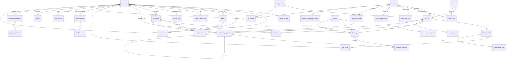

# zak1 — Data Model

_Point-in-time snapshot of the complete database schema, derived from the Drizzle schema
(`src/server/db/schema/`) and the hand-authored SQL migrations (`src/server/db/migrations/0001`–`0040`).
Current as of migration `0040_campaigns.sql`._

This is the single source-of-truth catalog for the CDR (Country Dancers of Rochester) platform's
Postgres schema across all implemented features (001–057, incl. Phase 4 payments/booking, Phase 5,
and Phase 7 public-site work).

## Conventions (apply everywhere unless noted)

- **PostgreSQL 16**, accessed via Drizzle ORM. Migrations are hand-authored SQL, each in its own
  transaction. `IF NOT EXISTS` / `IF EXISTS` guards make them idempotent.
- **Primary keys** are `uuid` with `DEFAULT gen_random_uuid()`, except: `series_qbo_map`
  (`series_id` is both PK and FK), `club_settings` (`smallint id` pinned to `1`), and
  `payment_bookings` (composite PK `(payment_id, booking_id)`).
- **Money is stored as integer cents everywhere** (columns named `*_cents`). Never floats.
- **Timestamps** are `timestamptz`; `created_at`/`updated_at` default to `now()`. Calendar dates
  (event date, membership expiry, parameter effective date) are `date`, surfaced by Drizzle as
  `YYYY-MM-DD` strings and handled in UTC. `start_time` is a bare `time` (venue-local wall clock).
- **Extensions** (enabled in `0001`): `pg_trgm` (fuzzy contact-name search) and `citext`
  (case-insensitive email).
- **Audit** is split: typed, queried audit tables (`status_change_audit`, `merge_audit`, the
  `*_audit` history tables) plus one general **`audit_events`** row-per-event trail (feature 016,
  written by `recordAudit`). A lightweight structured-log audit (pino) also exists and is not a table.
- The internal `_migrations` bookkeeping table is omitted here.

### Notable schema changes since the earlier snapshot (0014)

- **Dropped tables**: `rate_parameters`, `rate_parameter_audit`, `series_expense_parameters` (folded
  into `series_parameters`, migration 0012); `non_dance_income` (0031 — replaced by `gate_sales`
  categories/notes); `account_mapping` (0032 — QBO mapping is now series-only).
- **Dropped columns**: `contacts.volunteer_roles` (0021 — moved to `role_grants`);
  `bookings.check_number` (0026 — moved to `performer_payments`).
- **Retired enum**: `event_group_kind` → `event_groups.kind` is now free-text (0010/0015).
- **New tables**: `role_grants`, `audit_events`, `staff_identities`, `staff_sessions`,
  `venue_rents` (+audit), `performer_payments` (+`payment_bookings`), `membership_captures`,
  `paypal_notifications`, `content_pages`, `admission_prices`, `officers`, `announcements`,
  `campaigns`.

## Entity-Relationship Diagram

```mermaid
erDiagram
    contacts ||--o{ contact_emails : has
    contacts ||--o| contacts : "merged_into"
    contacts ||--o{ memberships : "is subject of"
    contacts ||--o{ payers : "may be"
    payers ||--o{ memberships : "pays for"
    contacts ||--o{ status_change_audit : logs
    contacts ||--o{ merge_audit : "canonical/merged"
    contacts ||--o| performers : "may back"
    contacts ||--o{ attendance : "checked in as"
    contacts ||--o{ gate_sales : "named on"
    contacts ||--o| staff_identities : "may authenticate as"
    contacts ||--o{ role_grants : holds
    contacts ||--o{ audit_events : "acted"
    contacts ||--o{ officers : "holds seat"
    contacts ||--o{ membership_captures : "resolves to"

    staff_identities ||--o{ staff_sessions : "opens"

    series ||--o{ events : schedules
    event_groups ||--o{ events : bundles
    venues ||--o{ events : hosts
    venues ||--o{ venue_rents : "priced by"
    series ||--o{ venue_rents : "override at venue"
    series ||--o| series_qbo_map : "maps to QBO"
    series ||--o{ series_parameters : "priced by"
    series ||--o{ admission_prices : "priced by"
    series ||--o{ quarterly_attendance_counts : "rolls up"
    series ||--o{ role_grants : "scopes"
    event_groups ||--o{ role_grants : "scopes"

    events ||--o| door_records : "has one"
    door_records ||--o{ gate_sales : itemizes
    door_records ||--o{ door_record_audit : logs
    events ||--o{ attendance : records
    events ||--o{ bookings : "books"
    events ||--o{ misc_expenses : incurs
    events ||--o{ performer_payments : disburses
    events ||--o{ treasurer_report_audit : logs

    performers ||--o{ bookings : "booked as"
    performers ||--o{ band_members : "roster of"
    performers ||--o{ performer_payments : "paid as payee"
    bands ||--o{ band_members : "has"
    bands ||--o{ bookings : "booked as unit"

    performer_payments ||--o{ payment_bookings : allocates
    bookings ||--o{ payment_bookings : "settled by"
    performer_payments ||--o| performer_payments : "reissue replaces"

    membership_captures ||--o{ paypal_notifications : "matched by"
```

_Standalone (no foreign keys): `club_settings`, `mapping_audit`, `content_pages`, `announcements`,
`campaigns`. `venue_rent_audit` and `series_parameter_audit` keep nullable FKs so history survives
deletion._

## Enums

| Enum | Values | Used by |
|---|---|---|
| `email_purpose` | personal, booking, public_profile, other | `contact_emails.purposes[]` |
| `email_status` | active, transition, inactive | `contact_emails.status` |
| `membership_status` | current, lapsed, long_lapsed, never | `contacts.membership_status`, `status_change_audit` |
| `membership_level` | individual, family, supporter, student | `memberships.level` (feature 044) |
| `email_consent_topic` | contra, english, openband, special_events, jane_austen_ball, contact_tracing, do_not_contact | `contact_emails.consent_topics[]` |
| `gate_category` | admission, merchandise, donation, future_event, membership, gift_card, misc_sales | `gate_sales.category` |
| `payment_method` | cash, card | `gate_sales.payment_method` |
| `performer_type` | caller, lead_musician, musician, open_band_musician, sound_tech, instructor | `bookings.performer_type` |
| `booking_status` | proposed, requested, tentative, confirmed, declined | `bookings.status` (features 018/020) |
| `event_status` | scheduled, cancelled | `events.status` (feature 018/B25) |
| `parameter_category` | rate, expense, door | `series_parameters.category` (feature 019 adds `door`) |
| `parameter_kind` | caller, sound_tech, musician, rent, ongoing, seed_float | `series_parameters.kind` (feature 019 adds `seed_float`) |
| `capture_status` | awaiting_payment, matched, expired | `membership_captures.status` (feature 019) |
| `notification_status` | matched, parked, resolved | `paypal_notifications.status` (feature 019) |
| `role` | door_attendant, booker, financial_secretary, treasurer, vice_president, webmaster, mailing_list_manager, secretary, president, super_user | `role_grants.role` (feature 016) |
| `mailing_list_id` | contra, english, openband, specialevents, performer, member, contact_tracing | `mailing_list_exports.list_id` |

_The `event_group_kind` enum was retired — `event_groups.kind` is now free text._

---

## 1. Contacts & Membership (features 001, 012, 019, 044)

### `contacts`

The person directory — the hub most other data links to. Names are structured (feature 012).

| Column | Type | Notes |
|---|---|---|
| id | uuid PK | |
| first_name | text NOT NULL | required (feature 012) |
| last_name | text NULL | optional (dancers may decline one) |
| display_name_override | text NULL | when non-blank, the effective display name |
| pronouns | text NULL | |
| display_name | text NOT NULL | **maintained** effective name (override, else "first last"); CHECK non-empty |
| name_normalized | text NOT NULL | search key; GIN trigram-indexed |
| dedup_normalized | text NOT NULL | dedup key; GIN trigram-indexed (feature 012) |
| membership_status | membership_status NOT NULL default `never` | materialized; recomputed on membership change + nightly |
| list_member | boolean NOT NULL default false | `status != never` — drives the member mailing list |
| status_recomputed_at | timestamptz NULL | |
| is_volunteer | boolean NOT NULL default false | **the staff access gate** (feature 015): re-checked live on every session read |
| volunteer_approved_at | timestamptz NULL | feature 016 annual President/VP review. **Advisory** — never on the session path |
| volunteer_approved_by | uuid NULL | who approved |
| merged_into_id | uuid NULL → contacts(id) | self-FK; non-null means this row was merged away |
| needs_review | boolean NOT NULL default false | door-created / no-contact-info contacts flagged for admin |
| source | text NULL | e.g. `door`, `performer` |
| phone | text NULL | optional (contact may give phone instead of email) |
| created_at, updated_at | timestamptz | |

- **Indexes**: `contacts_name_trgm` (GIN on `name_normalized`), `contacts_dedup_trgm` (GIN on
  `dedup_normalized`); partial `contacts_active` on `id WHERE merged_into_id IS NULL`.
- **Domain rules**: `membership_status`/`list_member` are **materialized**. Dedup **merges are soft** —
  the merged row stays with `merged_into_id` set; active queries filter `merged_into_id IS NULL`.
  `volunteer_roles` was **dropped in 0021** (roles moved to `role_grants` — an array cannot carry scope).

### `contact_emails`

Multiple emails per contact, each with its own purposes/consent.

| Column | Type | Notes |
|---|---|---|
| id | uuid PK | |
| contact_id | uuid NOT NULL → contacts(id) ON DELETE CASCADE | |
| email | citext NOT NULL | case-insensitive |
| purposes | email_purpose[] NOT NULL default `{personal}` | CHECK ≥1; GIN-indexed |
| consent_topics | email_consent_topic[] NOT NULL default `{contact_tracing}` | CHECK ≥1; GIN-indexed |
| status | email_status NOT NULL default `active` | |
| is_login | boolean NOT NULL default false | **the staff login identifier** (feature 015); at most one per contact |
| provider_set_date, provider_last_open, provider_last_click | timestamptz NULL | read-only provider telemetry (iContact) |
| created_at, updated_at | timestamptz | |

- **Unique**: `contact_emails_unique_active` — partial unique on `lower(trim(email)) WHERE status IN
  ('active','transition')`; `contact_emails_one_login_per_contact` — partial unique on `contact_id
  WHERE is_login` (feature 015).
- **Domain rules**: `contact_tracing` is the default consent topic. `do_not_contact` is exclusive —
  the service collapses `consent_topics` to `{do_not_contact}` when set, making mailing-list exclusion free.

### `payers`

Who paid for a membership (may differ from the member; may be an unlinked ad-hoc name).

| Column | Type | Notes |
|---|---|---|
| id | uuid PK | |
| contact_id | uuid NULL → contacts(id) ON DELETE SET NULL | optional linkage |
| name | text NOT NULL | |
| created_at | timestamptz | |

### `memberships`

One row per membership term; the contact's status is derived from the greatest expiry.

| Column | Type | Notes |
|---|---|---|
| id | uuid PK | |
| contact_id | uuid NOT NULL → contacts(id) ON DELETE CASCADE | |
| payer_id | uuid NOT NULL → payers(id) | |
| expiry_date | date NOT NULL | |
| level | membership_level NOT NULL default `individual` | feature 044 tier; backfilled for pre-load rows (0033) |
| source_gate_sale_id | uuid NULL | feature 019 provenance: door channel |
| source_notification_id | uuid NULL | feature 019 provenance: online channel |
| created_at | timestamptz | |

- **Indexes**: `memberships_contact`, `memberships_contact_expiry` `(contact_id, expiry_date DESC)`;
  partial UNIQUE `memberships_source_gate_sale` and `memberships_source_notification` (feature 019,
  0024) — make the door gate-save and PayPal-webhook channels **idempotent** (a re-save/replay collides
  instead of duplicating).
- **Domain rule**: status classified from `max(expiry_date)` vs. `club_settings.long_lapse_cycles` × cycle.

### `club_settings`

Singleton config row.

| Column | Type | Notes |
|---|---|---|
| id | smallint PK default 1 | CHECK `id = 1` (singleton) |
| long_lapse_cycles | integer NOT NULL default 3 | cycles before `long_lapsed` |
| cycle_definition | text NOT NULL default `1 year` | parsed as an interval |
| membership_year_end | text NOT NULL default `08-31` | feature 019: MM-DD year boundary (club year runs Sep 1 – Aug 31) |
| created_at, updated_at | timestamptz | |

### `status_change_audit`

Append-only log of membership-status transitions.

| Column | Type | Notes |
|---|---|---|
| id | uuid PK | |
| contact_id | uuid NOT NULL → contacts(id) ON DELETE CASCADE | |
| from_status | membership_status NULL | |
| to_status | membership_status NOT NULL | |
| reason | text NOT NULL | e.g. `membership_change`, `daily_job` |
| actor | text NULL | |
| created_at | timestamptz | |

### `merge_audit`

Append-only record of contact dedup merges.

| Column | Type | Notes |
|---|---|---|
| id | uuid PK | |
| canonical_id | uuid NOT NULL → contacts(id) | surviving contact |
| merged_id | uuid NOT NULL → contacts(id) | merged-away contact |
| actor | text NOT NULL | |
| relinked_counts | jsonb NOT NULL default `{}` | how many rows of each type were re-pointed |
| created_at | timestamptz | |

- **Indexes**: `merge_audit_canonical`, `merge_audit_merged`.

---

## 2. Series, Event Groups, Venues & Events (features 002, 007, 011, 013, 018, 052, 054)

### `series`

A standing dance series (config; seeded).

| Column | Type | Notes |
|---|---|---|
| id | uuid PK | |
| key | text NOT NULL UNIQUE | e.g. `tnc`, `ecd`, `community_dance`, `general` |
| name | text NOT NULL | |
| has_sound_tech | boolean NOT NULL default true | false for Community Dance (blocks Sound Tech bookings) |
| schedule_sentence | text NULL | feature 054: curated standing-schedule prose (no recurrence engine; carries the DST note) |
| created_at | timestamptz | |

- **Domain rule**: a `general` series exists for joint/cross-series events; there is **no fallback**
  between series for rates/expenses.

### `event_groups`

Bundles related events (Double Dance, weekend festival, Jane Austen Ball).

| Column | Type | Notes |
|---|---|---|
| id | uuid PK | |
| name | text NOT NULL | |
| kind | text NULL | free-text, optional category (was the retired `event_group_kind` enum) |
| created_at | timestamptz | |

### `venues`

Structured location for the public site's map and the bookings report.

| Column | Type | Notes |
|---|---|---|
| id | uuid PK | |
| name | text NOT NULL | |
| short_name | text NULL | feature 020: compact label for reports/cards; runtime fallback to name initials |
| address | text NOT NULL | |
| latitude, longitude | double precision NULL | preferred over address for the map when present |
| is_public | boolean NOT NULL default false | feature 052: opt-in public exposure of address/map/directions |
| directions | text NULL | feature 052: public directions/transit/parking note |
| landlord_contact_id | uuid NULL → contacts(id) ON DELETE SET NULL | feature 018 (B22): the party the Booker negotiates rent with |
| created_at, updated_at | timestamptz | |

- **Domain rule**: a venue's address/map/directions are exposed publicly **only when `is_public` AND
  it has an address** (feature 052).

### `events`

A single scheduled dance.

| Column | Type | Notes |
|---|---|---|
| id | uuid PK | |
| series_id | uuid NOT NULL → series(id) | |
| group_id | uuid NULL → event_groups(id) | |
| venue_id | uuid NULL → venues(id) ON DELETE SET NULL | |
| event_date | date NOT NULL | |
| label | text NULL | feature 013: distinguishes same-day group members |
| start_time | time NULL | feature 013: venue-local wall-clock time (no zone) |
| description | text NULL | feature 013: public blurb |
| charges_admission | boolean NOT NULL default true | false for free events |
| status | event_status NOT NULL default `scheduled` | feature 018 (B25): cancelled is retained + public-visible |
| advertised_price_cents | integer NULL | feature 018 (B27): public display price only, NEVER an accounting input |
| rent_cents | integer NULL | feature 011: per-event rent override; NULL = resolve from `venue_rents` |
| attendance_count | integer NOT NULL default 0 | **persisted counter**, survives the 90-day attendance purge |
| created_at | timestamptz | |

- **Indexes**: `events_series_date` `(series_id, event_date)`, `events_group` `(group_id)`.
- **Domain rule**: `attendance_count` is the source for "paying dancers" in the organizer report after
  identifiable attendance rows are purged.

---

## 3. Door, Gate & Attendance (features 002, 014, 017, 031)

### `door_records`

One per event; the money-capture header. **Exactly one per event** (unique `event_id`).

| Column | Type | Notes |
|---|---|---|
| id | uuid PK | |
| event_id | uuid NOT NULL UNIQUE → events(id) ON DELETE CASCADE | one-to-one |
| pos_transaction_count | integer NOT NULL default 0 | card ("PC") transaction count |
| pc_gross_cents | integer NOT NULL default 0 | card gross |
| pos_fee_cents | integer NOT NULL default 0 | card fee (hidden in UI; feeds Dance Net misc) |
| gross_cash_cents | integer NOT NULL default 0 | |
| seed_float_cents | integer NOT NULL default 1500 | starting till |
| cash_paid_out_cents | integer NOT NULL default 0 | |
| cash_paid_out_reason | text NULL | CHECK: required when `cash_paid_out_cents > 0` |
| deposit_cents | integer NOT NULL default 0 | |
| gift_card_redemption_count | integer NOT NULL default 0 | |
| comp_count | integer NOT NULL default 0 | feature 014: people admitted free; subtracted from paying dancers |
| open_band_count | integer NOT NULL default 0 | feature 017 (B36): open-band musicians comped (community_dance); kept separate from `comp_count` |
| created_at, updated_at | timestamptz | |

- **Domain rules**: **admission is DERIVED, never stored**. **Deposit = gross cash − seed float − cash
  paid out.** Report uses effective comps = `comp_count + open_band_count`.

### `gate_sales`

Line items under a door record, per category × payment method.

| Column | Type | Notes |
|---|---|---|
| id | uuid PK | |
| door_record_id | uuid NOT NULL → door_records(id) ON DELETE CASCADE | |
| category | gate_category NOT NULL | everything except `admission` is "Non-Dance Income" |
| payment_method | payment_method NOT NULL | cash / card |
| amount_cents | integer NOT NULL default 0 | |
| contact_id | uuid NULL → contacts(id) ON DELETE SET NULL | required for named categories; null = anonymous |
| note | text NULL | feature 031: free-text for the anonymous-sales section; null on named lines |

- **Indexes**: `gate_sales_contact` `(contact_id)`.
- **Domain rules**: donation / future_event / membership are named-customer receipts. The former
  `UNIQUE (door_record_id, category, payment_method)` was **dropped** (feature 031) so multiple
  anonymous misc-sales lines with distinct notes can coexist.

### `door_record_audit`

Append-only log of door-record edits.

| Column | Type | Notes |
|---|---|---|
| id | uuid PK | |
| door_record_id | uuid NOT NULL → door_records(id) ON DELETE CASCADE | |
| action | text NOT NULL | |
| actor | text NULL | |
| details | jsonb NOT NULL default `{}` | |
| created_at | timestamptz | |

- **Indexes**: `door_record_audit_record` `(door_record_id)`.

### `attendance`

Who was present (contact-tracing). **Purged after 90 days.**

| Column | Type | Notes |
|---|---|---|
| id | uuid PK | |
| event_id | uuid NOT NULL → events(id) ON DELETE CASCADE | |
| contact_id | uuid NULL → contacts(id) ON DELETE SET NULL | null = unmatched walk-in placeholder |
| children_count | integer NOT NULL default 0 | feature 017 (B35): children on this check-in (counted as paying) |
| is_open_band | boolean NOT NULL default false | feature 017 (B36): open-band musician marker (community_dance) |
| created_at | timestamptz | |

- **Indexes**: `attendance_event` `(event_id)`, `attendance_created` `(created_at)`; partial unique
  `attendance_event_contact` `(event_id, contact_id) WHERE contact_id IS NOT NULL`.
- **Domain rule**: rows older than 90 days roll up into `quarterly_attendance_counts` and are deleted;
  `events.attendance_count` persists so historical counts survive.

### `quarterly_attendance_counts`

Permanent aggregate that outlives the attendance purge.

| Column | Type | Notes |
|---|---|---|
| id | uuid PK | |
| series_id | uuid NOT NULL → series(id) | |
| year | integer NOT NULL | |
| quarter | smallint NOT NULL | CHECK 1–4 |
| attendee_count | integer NOT NULL default 0 | |

- **Unique**: `(series_id, year, quarter)`.

---

## 4. Performers, Bands & Bookings (features 003, 008, 018, 020, 053)

### `performers`

A bookable performer; each may have a backing contact (for door check-in).

| Column | Type | Notes |
|---|---|---|
| id | uuid PK | |
| display_name | text NOT NULL | |
| contact_id | uuid NULL → contacts(id) ON DELETE SET NULL | auto-created if none supplied |
| bio | text NULL | public bio |
| photo_url | text NULL | public photo |
| is_public | boolean NOT NULL default false | feature 053: opt into public roster exposure |
| is_caller | boolean NOT NULL default false | feature 053: list individually in the callers roster |
| styles | text[] NOT NULL default `[]` | feature 053: roster grouping/filter |
| links | jsonb (PromoLink[]) NOT NULL default `[]` | feature 053: self-published promo links |
| created_at, updated_at | timestamptz | |

- **Indexes**: `performers_contact` `(contact_id)`.

### `bands`

A reusable, named roster with its own identity.

| Column | Type | Notes |
|---|---|---|
| id | uuid PK | |
| name | text NOT NULL | |
| bio | text NULL | band's own bio |
| photo_url | text NULL | band's own photo |
| archived_at | timestamptz NULL | **soft-delete**: null = active/selectable |
| is_public | boolean NOT NULL default false | feature 053: publicly exposable iff `is_public` AND not archived |
| styles | text[] NOT NULL default `[]` | feature 053: roster grouping/filter |
| links | jsonb (PromoLink[]) NOT NULL default `[]` | feature 053: promo links |
| created_at, updated_at | timestamptz | |

- **Domain rules**: band identity is **live** — edits update all events. "Delete" sets `archived_at`.

### `band_members`

The roster (one Lead + members), all existing performers.

| Column | Type | Notes |
|---|---|---|
| id | uuid PK | |
| band_id | uuid NOT NULL → bands(id) ON DELETE CASCADE | |
| performer_id | uuid NOT NULL → performers(id) ON DELETE RESTRICT | |
| is_lead | boolean NOT NULL default false | |
| instrument | text NULL | feature 053: optional instrument shown on the roster/lineup |
| created_at | timestamptz | |

- **Unique**: `(band_id, performer_id)`.
- **Domain rules**: the service enforces exactly one `is_lead = true` per band. A performer may belong
  to many bands.

### `bookings`

One performer booked onto one event.

| Column | Type | Notes |
|---|---|---|
| id | uuid PK | |
| event_id | uuid NOT NULL → events(id) ON DELETE CASCADE | |
| performer_id | uuid NOT NULL → performers(id) | |
| band_id | uuid NULL → bands(id) | set only for "book-as-unit" bookings; null = ad-hoc |
| performer_type | performer_type NOT NULL | |
| status | booking_status NOT NULL default `proposed` | features 018/020 lifecycle; only `confirmed` shows publicly |
| pay_cents | integer NOT NULL default 0 | expected pay (see `performer_payments` for actual) |
| is_donated | boolean NOT NULL default false | donated fee → $0, counts appearance, excluded from YTD earnings |
| is_overridden | boolean NOT NULL default false | pay manually overridden vs. the standard rate |
| requires_check | boolean NOT NULL default false | true only when the type requires a check AND pay > 0 |
| note | text NULL | e.g. Instructor's public note |
| created_at, updated_at | timestamptz | |

- **Indexes**: `bookings_event` `(event_id)`, `bookings_performer` `(performer_id)`,
  `bookings_event_band` `(event_id, band_id)`.
- **Domain rules**: `check_number` was **dropped in 0026** — what was actually paid now lives in
  `performer_payments`. No `(event, performer)` uniqueness (book-as-unit skips an already-booked member).
  Public display follows type rules; the confirmed-only public rule (018) is applied on read.

---

## 5. Performer Payments (features 019/B28, 023/030)

### `performer_payments`

What was **actually disbursed** to a performer — distinct from a booking's expected `pay_cents`. The
payee may differ from the booked performer (a substitute sat in).

| Column | Type | Notes |
|---|---|---|
| id | uuid PK | |
| event_id | uuid NOT NULL → events(id) ON DELETE CASCADE | |
| payee_performer_id | uuid NOT NULL → performers(id) | not cascaded — financial history outlives a performer cleanup |
| amount_cents | integer NOT NULL | |
| check_number | text NULL | |
| override_reason | text NULL | |
| voided_at | timestamptz NULL | feature 023: a voided check persists and never settles a booking |
| void_reason | text NULL | |
| replaces_payment_id | uuid NULL → performer_payments(id) | feature 023: a reissue points back at the check it replaces |
| created_at, updated_at | timestamptz | |

- **Indexes**: `performer_payments_event` `(event_id)`.

### `payment_bookings`

Many-to-many allocation so one check can settle several bookings.

| Column | Type | Notes |
|---|---|---|
| payment_id | uuid NOT NULL → performer_payments(id) ON DELETE CASCADE | |
| booking_id | uuid NOT NULL → bookings(id) ON DELETE CASCADE | |
| amount_cents | integer NOT NULL | feature 023: per-line allocation; lines of a check sum to its total |

- **PK**: `(payment_id, booking_id)`. **Indexes**: `payment_bookings_booking` `(booking_id)`.
- **Domain rule**: a booking may appear under zero payments (unpaid) or more; the reconciliation delta,
  not a constraint, surfaces any mismatch.

---

## 6. Membership Acquisition — Online (feature 019 / B30)

### `membership_captures`

Website-submitted prospective-member info, held server-side awaiting a verified PayPal notification
whose payer email matches. Inert until then — not a contact, not a membership.

| Column | Type | Notes |
|---|---|---|
| id | uuid PK | |
| email | text NOT NULL | match key (compared case-insensitively) |
| name | text NOT NULL | |
| contact_id | uuid NULL → contacts(id) ON DELETE SET NULL | resolved on match |
| status | capture_status NOT NULL default `awaiting_payment` | latest awaiting capture per email wins; older → `expired` |
| created_at | timestamptz | |

- **Indexes**: `membership_captures_email` on `lower(email)`.

### `paypal_notifications`

Every **verified** PayPal notification (unverifiable ones are rejected upstream, never stored).

| Column | Type | Notes |
|---|---|---|
| id | uuid PK | |
| provider_event_id | text NOT NULL UNIQUE | **idempotency guarantee** (FR-013) — a replay collides here |
| event_type | text NOT NULL | |
| payer_email | text NULL | |
| amount_cents | integer NOT NULL | |
| capture_id | uuid NULL → membership_captures(id) ON DELETE SET NULL | |
| status | notification_status NOT NULL | matched / parked / resolved |
| raw_payload | jsonb NOT NULL | kept for manual reconciliation of parked payments |
| received_at | timestamptz | |

---

## 7. Series-Scoped Rate/Expense/Door Parameters & Venue Rents (features 009, 011, 019)

### `series_parameters`

One effective-dated table for standard performer rates, series expenses, and (feature 019) the
per-series till float. Consolidates the former `rate_parameters` + `series_expense_parameters` (0012).

| Column | Type | Notes |
|---|---|---|
| id | uuid PK | |
| category | parameter_category NOT NULL | `rate` · `expense` · `door` |
| kind | parameter_kind NOT NULL | rate: caller/sound_tech/musician · expense: rent/ongoing · door: seed_float |
| series_id | uuid NOT NULL → series(id) ON DELETE CASCADE | **mandatory** — every parameter is series-scoped |
| amount_cents | integer NOT NULL | |
| label | text NULL | expense-only (e.g. "Equipment Depreciation") |
| effective_date | date NOT NULL | |
| created_at | timestamptz | |

- **Indexes**: `series_parameters_lookup` `(series_id, category, kind, effective_date DESC)`.
- **Domain rules**: resolution = greatest `effective_date ≤ target` for (series, category, kind); 0 if
  none. Append-only; no fallback between series.

### `series_parameter_audit`

Append-only history of parameter changes.

| Column | Type | Notes |
|---|---|---|
| id | uuid PK | |
| category | parameter_category NOT NULL | |
| kind | parameter_kind NOT NULL | |
| series_id | uuid NULL → series(id) ON DELETE SET NULL | nullable only for migrated pre-series-scoping legacy history |
| amount_cents | integer NOT NULL | |
| label | text NULL | |
| effective_date | date NOT NULL | |
| actor | text NULL | |
| created_at | timestamptz | |

### `venue_rents`

Rent keyed by (venue, series), effective-dated (feature 011). `series_id` NULL = venue default; set =
series-at-venue override. Per-event overrides live on `events.rent_cents`.

| Column | Type | Notes |
|---|---|---|
| id | uuid PK | |
| venue_id | uuid NOT NULL → venues(id) ON DELETE CASCADE | |
| series_id | uuid NULL → series(id) ON DELETE CASCADE | NULL = venue default |
| amount_cents | integer NOT NULL | |
| effective_date | date NOT NULL | |
| created_at | timestamptz | |

- **Indexes**: `venue_rents_lookup` `(venue_id, series_id, effective_date DESC)`.

### `venue_rent_audit`

Append-only history; nullable FKs (SET NULL) so history survives venue/series deletion.

| Column | Type | Notes |
|---|---|---|
| id | uuid PK | |
| venue_id | uuid NULL → venues(id) ON DELETE SET NULL | |
| series_id | uuid NULL → series(id) ON DELETE SET NULL | |
| amount_cents | integer NOT NULL | |
| effective_date | date NOT NULL | |
| actor | text NULL | |
| created_at | timestamptz | |

### `admission_prices` (feature 054 / P7-R10)

Admission pricing tiers. A "revision" is the batch of rows sharing one `effective_date`; an event
resolves the revision with the greatest `effective_date ≤ its date`.

| Column | Type | Notes |
|---|---|---|
| id | uuid PK | |
| series_id | uuid NOT NULL → series(id) ON DELETE CASCADE | |
| label | text NOT NULL | tier label (e.g. "Dancer", "Supporter") |
| amount_cents | integer NOT NULL | 0 ⇒ configured-free tier |
| sort_order | integer NOT NULL default 0 | |
| effective_date | date NOT NULL | |
| created_at | timestamptz | |

- **Indexes**: `admission_prices_series_date_idx` `(series_id, effective_date DESC)`.

---

## 8. Treasurer & QBO (features 004, 005)

### `series_qbo_map`

Per-series QBO customer/class (one row per series). The former standalone `account_mapping` chart-of-
accounts table was **dropped in 0032** — QBO mapping is now series-only.

| Column | Type | Notes |
|---|---|---|
| series_id | uuid PK → series(id) ON DELETE CASCADE | PK is the FK (one-to-one with series) |
| gate_customer | text NOT NULL | |
| qbo_class | text NOT NULL | |
| updated_at | timestamptz | |

### `misc_expenses` (feature 005)

Per-event ad-hoc expenses feeding Dance Net.

| Column | Type | Notes |
|---|---|---|
| id | uuid PK | |
| event_id | uuid NOT NULL → events(id) ON DELETE CASCADE | |
| description | text NOT NULL | CHECK non-empty |
| amount_cents | integer NOT NULL | |
| created_at | timestamptz | |

- **Indexes**: `misc_expenses_event` `(event_id)`.
- **Domain rule**: an event's Misc Expenses total = Σ these rows + the door record's card fee
  (`pos_fee_cents`). (The former `non_dance_income` table was **dropped in 0031** — non-dance income
  now lives in `gate_sales` categories.)

### `mapping_audit`

Append-only log of QBO series-mapping edits (standalone).

| Column | Type | Notes |
|---|---|---|
| id | uuid PK | |
| mapping_kind | text NOT NULL | e.g. `series` |
| key | text NOT NULL | the series id changed |
| details | jsonb NOT NULL default `{}` | |
| actor | text NULL | |
| created_at | timestamptz | |

### `treasurer_report_audit`

Append-only log of treasurer-report generation.

| Column | Type | Notes |
|---|---|---|
| id | uuid PK | |
| event_id | uuid NOT NULL → events(id) ON DELETE CASCADE | |
| actor | text NULL | |
| created_at | timestamptz | |

---

## 9. Mailing-List Exports (feature 006)

### `mailing_list_exports`

Audit trail of on-demand CSV exports (the CSV rows themselves are never stored).

| Column | Type | Notes |
|---|---|---|
| id | uuid PK | |
| list_id | mailing_list_id NOT NULL | one of the mailing lists, or `contact_tracing` |
| event_id | uuid NULL → events(id) ON DELETE SET NULL | set only when `list_id = contact_tracing` |
| row_count | integer NOT NULL | rows in the generated CSV |
| actor | text NULL | |
| created_at | timestamptz | |

- **Indexes**: `mailing_list_exports_lookup` `(list_id, created_at DESC)`.
- **Domain rule**: exported rows (email/name/consent) are computed at request time, never persisted.

---

## 10. Staff Authentication & Sessions (feature 015)

Staff sign in with **Google**; the platform stores **no password**. A Google account binds to an
existing **volunteer** contact by matching Google's verified email to an active `contact_emails` row.
There is deliberately **no `users` table** — the person _is_ a `contact`.

### `staff_identities`

A volunteer contact's ability to authenticate via Google. Holds no secret.

| Column | Type | Notes |
|---|---|---|
| id | uuid PK | |
| contact_id | uuid NOT NULL UNIQUE → contacts(id) ON DELETE CASCADE | **one identity per person** |
| google_sub | text NOT NULL UNIQUE | Google's immutable account id — the durable link |
| created_at | timestamptz NOT NULL default now() | row created on first successful sign-in |
| last_sign_in_at | timestamptz NULL | |

- **Domain rules**: provisioned automatically on first sign-in. `google_sub` wins once bound; a changed
  email keeps the binding (logged). Eligibility is read live from `contacts.is_volunteer`, never copied.

### `staff_sessions`

A revocable authenticated period (server-side, not a JWT — a stateless token cannot be revoked).

| Column | Type | Notes |
|---|---|---|
| id | uuid PK | |
| staff_identity_id | uuid NOT NULL → staff_identities(id) ON DELETE CASCADE | |
| token_hash | text NOT NULL UNIQUE | **SHA-256 hash only** — the raw token lives solely in the client cookie |
| created_at | timestamptz NOT NULL default now() | |
| last_seen_at | timestamptz NOT NULL default now() | advanced on each authenticated read (rolling window) |
| expires_at | timestamptz NOT NULL | `last_seen_at + SESSION_IDLE_TTL_HOURS` (default 8) |

- **Indexes**: `staff_sessions_identity_idx` on `staff_identity_id`.
- **Domain rule**: every session read joins `staff_sessions → staff_identities → contacts` and requires
  `contacts.is_volunteer`, so withdrawing access locks the person out on their next request.

---

## 11. Authorization — Role Grants (feature 016)

### `role_grants`

One role at one scope, held by one volunteer contact. Replaces the retired `contacts.volunteer_roles`
array (which could not carry scope).

| Column | Type | Notes |
|---|---|---|
| id | uuid PK | |
| contact_id | uuid NOT NULL → contacts(id) ON DELETE CASCADE | grants die with the person |
| role | `role` NOT NULL | the ten grants; `organizer` is the implicit base, not a row |
| series_id | uuid NULL → series(id) | set ⇒ per-series scope |
| group_id | uuid NULL → event_groups(id) | set ⇒ per-event-group scope |
| granted_by | uuid NULL → contacts(id) | NULL = operator CLI (not cascaded — outlives the granter) |
| granted_at | timestamptz NOT NULL default now() | |

- **Scope is the SHAPE of the row**: both NULL = club-wide, `series_id` set = per-series, `group_id`
  set = per-event-group. Series and group are orthogonal axes — two independent nullable FKs, never a
  polymorphic `scope_id`.
- **Constraints**: `grant_scope_exclusive CHECK (num_nonnulls(series_id, group_id) <= 1)`;
  `role_grants_unique UNIQUE NULLS NOT DISTINCT (contact_id, role, series_id, group_id)`. **No
  uniqueness on role** (two people may hold President).
- **Indexes**: `role_grants_contact_idx` `(contact_id)`.
- **Not in the table**: President/VP/Treasurer mutual exclusivity and only-a-volunteer-may-hold-a-grant
  (both enforced in `grantService` + the live session join).

### `audit_events`

The general audit trail (feature 016). `recordAudit(db, …)` writes a row **and** logs.

| Column | Type | Notes |
|---|---|---|
| id | uuid PK | |
| kind | text NOT NULL | `text`, not an enum — the union grows every feature; nothing joins on it |
| actor_contact_id | uuid NULL → contacts(id) | NULL for system/CLI actors |
| details | jsonb NOT NULL default `{}` | e.g. `pii.disclosed` → `{surface, count}` (per request) |
| occurred_at | timestamptz NOT NULL default now() | |

- **Indexes**: `audit_events_occurred_idx` `(occurred_at)`, `audit_events_kind_idx` `(kind,
  occurred_at)`, `audit_events_actor_idx` `(actor_contact_id, occurred_at)`.

**Current `kind` union** (from `src/server/lib/audit.ts`) — grouped by originating feature:

- **Contacts / membership**: `contact.merge`, `membership.status_change`, `contact.created`,
  `email.created`, `contact.bulk_load` (044)
- **Door / attendance**: `door_record.created`, `door_record.updated`, `attendance.purge`,
  `attendance.updated`, `attendance.deleted`
- **Bookings**: `booking.created`, `booking.updated`, `booking.deleted`, `booking.donated` (030),
  `booking.settlement_added` (030)
- **Parameters / treasurer / QBO**: `rate_parameter.created`, `door_parameter.created`,
  `expense_parameter.created`, `treasurer_report.generated`, `qbo_mapping.updated`,
  `admission_pricing.set` (054)
- **Bands / venues / events**: `band.created`, `band.updated`, `band.deleted`, `band.booked`,
  `venue.created`, `venue.updated`, `venue_rent.created`, `event.rent_set`, `event.deleted`,
  `event.generated`, `event.status_changed`
- **Mailing lists**: `mailing_list.exported`
- **Auth (015)**: `auth.bootstrap.designated`, `auth.identity.created`, `auth.signin.succeeded`,
  `auth.signin.refused`, `auth.signout`
- **Authorization (016)**: `authz.grant.created`, `authz.grant.revoked`, `authz.refused`,
  `volunteer.designated`, `volunteer.cleared`, `volunteer.approved`, `pii.disclosed`
- **Payments & membership acquisition (019)**: `membership.door_enrollment`,
  `membership.online_enrollment`, `performer_payment.created`, `performer_payment.updated`,
  `performer_payment.voided`, `performer_payment.deleted`, `paypal.notification.parked`,
  `paypal.notification.rejected`, `paypal.notification.linked`
- **Officers (055)**: `officer.set`
- **Content CMS (051)**: `content.created`, `content.updated`, `content.published`,
  `content.unpublished`, `content.deleted`
- **Announcements (056)**: `announcement.posted`, `announcement.cleared`
- **Campaigns (057)**: `campaign.created`, `campaign.updated`, `campaign.deleted`

---

## 12. Public Site — Content, Officers, Announcements & Campaigns (Phase 7)

### `content_pages` (feature 051 / P7-R7)

Editable public prose pages (Tier-2 CMS). Body is Markdown, rendered to sanitized HTML on read.

| Column | Type | Notes |
|---|---|---|
| id | uuid PK | |
| slug | text NOT NULL UNIQUE | public URL segment; validated against `RESERVED_SLUGS`; create-only |
| title | text NOT NULL | |
| draft_body | text NOT NULL | what the Webmaster edits/previews |
| published_body | text NULL | what the public sees; null until first publish, retained on unpublish |
| published | boolean NOT NULL default false | gates public visibility |
| summary | text NULL | |
| created_at, updated_at | timestamptz | |

- **Domain rule**: the public read exposes the **published** body only, never the draft; editing the
  draft does not change the public page until re-publish.

### `officers` (feature 055 / P7-R12)

The current holder of each board-seat role (`role_key` from the committed club-role registry). One row
per role; the person's name is joined from `contacts`.

| Column | Type | Notes |
|---|---|---|
| id | uuid PK | |
| role_key | text NOT NULL UNIQUE | registry key |
| contact_id | uuid NOT NULL → contacts(id) ON DELETE CASCADE | |
| created_at, updated_at | timestamptz | |

### `announcements` (feature 056 / P7-R13)

The site-wide announcement banner. Each post is a row; the latest by `posted_at` is the current notice.
Active is derived on read — no scheduler.

| Column | Type | Notes |
|---|---|---|
| id | uuid PK | |
| text | text NOT NULL | |
| link_label | text NULL | |
| link_url | text NULL | |
| level | text NOT NULL default `info` | severity/style |
| duration_hours | integer NOT NULL default 24 | |
| posted_at | timestamptz NOT NULL default now() | |
| cleared_at | timestamptz NULL | |
| created_at | timestamptz | |

- **Indexes**: `announcements_posted_at_idx` `(posted_at DESC)`.
- **Domain rule**: active ⟺ `cleared_at IS NULL AND now() < posted_at + duration_hours`. Independent of
  event status (feature 018).

### `campaigns` (feature 057 / P7-R14)

The home-page promotional campaign slot. Campaigns form a queue; the home page shows exactly one — among
rows whose window includes today, the one that **expires first**.

| Column | Type | Notes |
|---|---|---|
| id | uuid PK | |
| heading | text NOT NULL | |
| blurb | text NOT NULL | |
| image_url | text NULL | |
| image_alt | text NULL | |
| cta_label | text NOT NULL | |
| cta_url | text NOT NULL | |
| start_date | date NOT NULL | |
| end_date | date NOT NULL | |
| created_at, updated_at | timestamptz | |

- **Constraints**: `campaigns_window_ck CHECK (end_date >= start_date)`.
- **Indexes**: `campaigns_window_idx` `(end_date, start_date, created_at)` — backs the "expires first"
  selection (min end_date; ties: min start_date, then created_at).
- **Domain rule**: active is derived on read (window includes today); no scheduler.

_Note — the **printable calendar** (feature 058 / P7-R15) added **no** persisted entities: it is a
render-only view assembled from live `events`, `series` (`schedule_sentence`), `bookings`, `venues`,
and `admission_prices`._

---

## Deferred / not modeled

These were specced but intentionally **not built** (no tables exist), per project decisions:

- **Online advance-ticket sales** (feature 007 US2 — PayPal advance tickets): deferred; the public site
  is browse-only. Online **membership** purchase, by contrast, **is** built (feature 019 — see
  `membership_captures` / `paypal_notifications`).
- **Group tickets** (BACKLOG B1): one ticket redeemable across an `EventGroup`'s events — the
  `event_groups` scaffolding exists, but purchase/redemption/revenue-split do not.
- **Self-service Google re-binding** (B38), **primary-email designation** (B3), and **reusable
  cross-club directories** (multi-tenant) — all future-phase.
